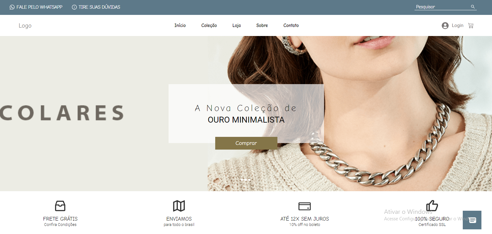
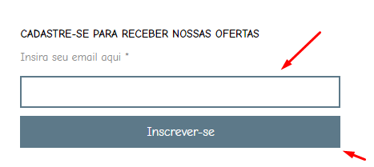
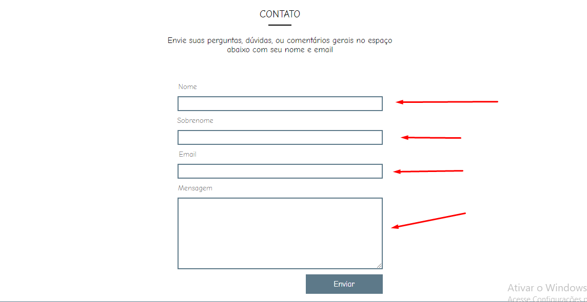

# Projeto Joalheria

<!---Esses são exemplos. Veja https://shields.io para outras pessoas ou para personalizar este conjunto de escudos. Você pode querer incluir dependências, status do projeto e informações de licença aqui--->




> Um projeto de e-commerce para uma loja de joias, onde o cliente pode fazer compras, ver produtos e entrar em contato com o dono da loja

<p align="center">Acesse o projeto clicando <a href="https://projeto-joalheria.vercel.app/"> aqui </a></p>

### Ajustes e melhorias

O projeto ainda está em desenvolvimento e as próximas atualizações serão voltadas nas seguintes tarefas:

- [x] Criar estrutura do site 
- [x] Adicionar o react-router e concluir outras páginas do projeto
- [x] Adicionar o redux para ter contexto global 
- [x] Adicionando, removendo e contas no carrinho 
- [x] Adicionar página para login de usuário 
- [x] Adicionar páginas para produtos unitários
- [x] Adicionar comunicação por email (report a empresa)

## 💻 Pré-requisitos

Antes de começar, verifique se você atendeu aos seguintes requisitos:
<!---Estes são apenas requisitos de exemplo. Adicionar, duplicar ou remover conforme necessário--->
* Você instalou a versão mais recente das linguagens, dependências e bibliotecas requiridas
* Você leu o guia relacionado ao projeto

## 🔧 Tecnologias usadas no projeto: 

</img>
</img>
</img>
</img>
</img>
</img>
</img>

## 🚀 Instalando Projeto Joalheria

Para instalar o projeto, siga estas etapas:

Windows:
```
npm install
```

## ☕ Usando Projeto Joalheria

Para usar o projeto, siga estas etapas:

```
Adicione itens ao seu carrinho, faça comunicação com a empresa pelo report e receba promoções pelo seu email ao cadastrar
```

## 🔐Fazer login no projeto 

```
Email: callegarog00@gmail.com
Password: callegaro2018
```

## ✉ Serviço de email do projeto 
 <p align="center"> O Projeto está dividido em duas partes de comunicação, na primeira você insere o seu email, que irá passar por uma verificação e então, se ele for validado, irá receber um email neste. Veja exemplo na imagem abaixo:</p>
 
  </img>
 
 Para enviar uma mensagem para empresa, você deve ir na seguinte página e escrever sua mensagem. Após toda verificação ser feita, o emial será enviado. Veja exemplo na imagem abaixo:
 
  </img> 
 
> Observação sobre contato com a empresa: Por ser um serviço gratuito, a empresa sempre receberá mensagem devido por mi. e nãopelo que foi inserido pelo usuário!
> Observação geral 1: O serviço de entrega de emial é limitado, ou seja, quando você testar, pode ter tido o limite excedido!

```
Email e senha para verificar emails para empresa: 

email: bijoujoalheria@gmail.com
senha: bijou1234
```


## 📫 Contribuindo para o projeto
<!---Se o seu README for longo ou se você tiver algum processo ou etapas específicas que deseja que os contribuidores sigam, considere a criação de um arquivo CONTRIBUTING.md separado--->
Para contribuir com o projeto, siga estas etapas:

1. Bifurque este repositório.
2. Crie um branch: `git checkout -b <nome_branch>`.
3. Faça suas alterações e confirme-as: `git commit -m '<mensagem_commit>'`
4. Envie para o branch original: `git push origin <nome_do_projeto> / <local>`
5. Crie a solicitação de pull.

Como alternativa, consulte a documentação do GitHub em [como criar uma solicitação pull](https://help.github.com/en/github/collaborating-with-issues-and-pull-requests/creating-a-pull-request).

## 🤝 Colaboradores

Agradecemos às seguintes pessoas que contribuíram para este projeto:

<table>
  <tr>
    <td align="center">
      <a href="#">
        <br>
        <sub>
          <b>Geovanne Callegaro</b>
        </sub>
      </a>
    </td>
  </tr>
</table>

## 📝 Licença

Esse projeto está sob licença. Veja o arquivo [LICENÇA](LICENSE.md) para mais detalhes.
